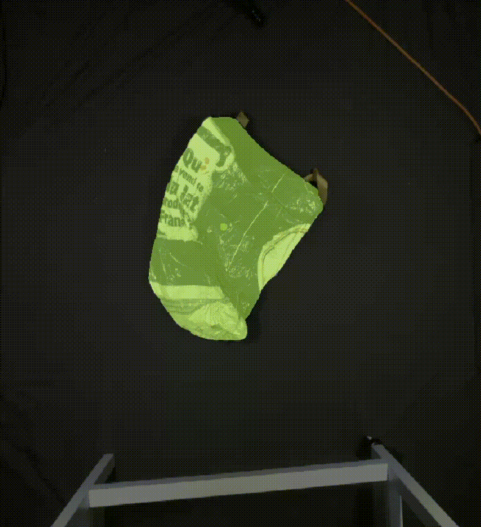

# SAM_knowledge_Distillation
An implementation and visualization of a distilled Mobile SAM into a very small architecture optimised for edge device

# Wasoria5k Dataset 
https://mega.nz/file/LUh3hSoZ#0CAfOVv8XR0-XX9opib2FN80O9sHDo43UQUC6c8ABPw

## Video Demonstration

## TENSORRT AND ONNX INSTALLATION

# TENSORRT

<pre>
conda create --name correct-nano python=3.8.10
conda activate correct-nano 

#PYTORCH 
conda install pytorch==2.0.1 torchvision==0.15.2 torchaudio==2.0.2 pytorch-cuda=11.8 -c pytorch -c nvidia

python3 -m pip install --upgrade nvidia-tensorrt
python3 -m pip install nvidia-pyindex

# TORCHRT
git clone https://github.com/NVIDIA-AI-IOT/torch2trt
cd torch2trt
python setup.py install

#TIMM
pip install git+https://github.com/rwightman/pytorch-image-models.git 

#TRANSFORMERS
python3 -m pip install transformers

#NANOSAM
git clone https://github.com/NVIDIA-AI-IOT/nanosam
cd nanosam
python3 setup.py develop --user

#TRTEXEC
micro ~/.bashrc
export PATH=/usr/local/TensorRT-10.0.1/bin:$PATH
alias trtexec="/usr/src/tensorrt/bin/trtexec"

#ONNX Install
conda install -c conda-forge onnx 
#or
pip install onnx
</pre>
